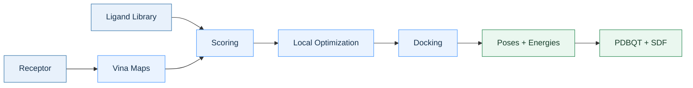
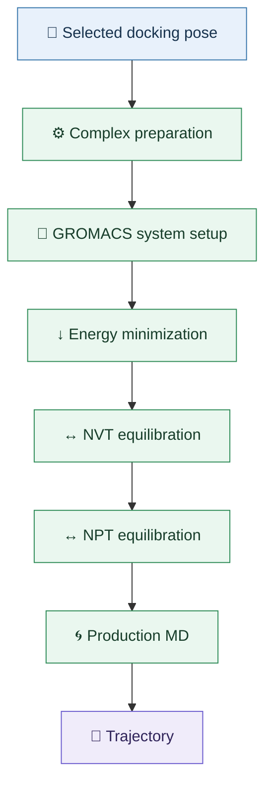
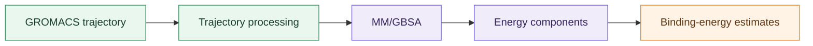

<div align="center">

# 🧬 YeAST

### **Yet Another Screening Tool**

**High-throughput virtual screening · Molecular docking · Molecular dynamics · MM/GBSA**

<br>


<br>

**YeAST** is a modular and containerized framework for protein–ligand virtual screening,
molecular docking and post-docking molecular dynamics analysis.

</div>

---

## 🧭 Overview

YeAST connects the main computational steps involved in a protein–ligand screening workflow.

Instead of treating docking, molecular dynamics and energetic analysis as separate projects, YeAST provides a common workflow in which selected docking poses can be carried forward into molecular dynamics and subsequently analyzed through MM/GBSA.

```mermaid
flowchart LR

    A["🧬 Receptor Preparation"] --> B["⚗️ Ligand Preparation"]

    B --> C["📦 Docking Box"]
    C --> D["🔬 AutoDock Vina"]
    D --> E["🎯 Selected Poses"]
    E --> F["🌀 GROMACS MD"]
    F --> G["📈 MM/GBSA"]
    G --> H["📊 Energy Estimates"]

    classDef ligand fill:#E8F1FB,stroke:#3776AB,color:#17324D
    classDef docking fill:#EAF3FF,stroke:#4C9AFF,color:#17324D
    classDef md fill:#EAF7EF,stroke:#2E8B57,color:#173D2A
    classDef analysis fill:#F0ECFA,stroke:#6A5ACD,color:#30245A

    class A,B,C ligand
    class D,E,F docking
    class G md
    class H,I analysis
```



The screening environment and the molecular-dynamics environment are kept separate through containers. This makes it possible to maintain independent software dependencies while keeping the overall workflow connected.

---

## ✨ Workflow

| Stage                       | Purpose                                                                   |
| --------------------------- | ------------------------------------------------------------------------- |
| 🧪 **Ligand preparation**   | Protonation, hydrogen handling, conformer generation and PDBQT conversion |
| 🧬 **Receptor preparation** | Cleaning, hydrogen addition and PDBQT conversion                          |
| 📦 **Box generation**       | Geometric, crystallographic-ligand or user-defined docking boxes          |
| 🔬 **Docking**              | AutoDock Vina scoring, optimization and pose generation                   |
| 🌀 **Molecular dynamics**   | GROMACS simulations of selected protein–ligand complexes                  |
| 📈 **MM/GBSA**              | Post-MD energetic analysis of selected complexes                          |
| 🐳 **Containers**           | Reproducible and separated computational environments                     |

---
## 🚀 Installation

### Requirements

* Linux
* Docker
* Internet connection during image construction

### Clone the repository

```bash
git clone https://github.com/halgocom/yeast.git
cd yeast
```

Make the helper scripts executable:

```bash
chmod +x build.sh
chmod +x buildsave.sh
chmod +x buiran.sh
chmod +x loadrun.sh
chmod +x run.sh
```

---

## 🔨 Build

Build the screening image with:

```bash
./build.sh
```

When prompted for the module, enter:

```text
screener
```

The resulting image contains the Python screening environment and the tools required for ligand/receptor preparation and AutoDock Vina docking.

### Export the image (Optional)

```bash
./buildsave.sh
```

The generated Docker archive can be transferred to another machine and loaded without rebuilding the environment.

### Load an existing image

```bash
./loadrun.sh
```

### Run YeAST

```bash
./run.sh
```

Select:

```text
screener
```

## 📋 Example YeAST virtual screening protocol
```python
    from mk_pipeline import MeekoPipeline
    from filters import LipinskiRDKit
    from forcefield import RdkitEtkgd
    from AutoDockScreen import calc_map,basic_docking

    
    
    if __name__ == "__main__":
    
        clean_settings = {"1z95":{"ligand":"198","chain":"A","altloc":"A","pH":6.1}}
    
        dock=MeekoPipeline(experiment_id="prost_canc",replicates=10,run_name="crest_vinardo")
    
        dock.load_targets("1z95")
        dock.target_cleanup(**clean_settings)
        dock.process_targets(box={"1z95": ((28.1117, 1.4037, 6.5190),(26.0, 26.0, 26.0))})
    
        dock.load_ligands(filename="cannabinoids_inib_opt.sdf.gz",sdf_confs=True)
        
        dock.filter_ligands(filter_f=LipinskiRDKit)
        
        dock.optimize_ligand(protonate=True,pH_max=6.5,pH_min=6.1)
    
        dock.process_ligands(output="path")
        
        dock.init_docking(safety_factor=1)
    
        dock.calculate_maps(map_f=calc_map,map_mode="o4a",target_id="1z95",target_box=True)
    
        dock.screen_single_target(dock_f=basic_docking,target_id="1z95",verbosity=0,sf_name="vinardo",poses=10)
    
        dock.check_poses(target_id="1z95",redock="RBICALUTAMIDE",box_threshold=0.9)
        dock.analyze_interactions(target_id="1z95")
        dock.calc_metrics(("ki","le"),target_id="1z95")
    
        dock.create_report

```
---
## 🧬 Receptor preparation
```python

        clean_settings = {"1z95":{"ligand":"198","chain":"A","altloc":"A","pH":6.1}}
    
        dock=MeekoPipeline(experiment_id="prost_canc",replicates=10,run_name="crest_vinardo")
    
        dock.load_targets("1z95")
        dock.target_cleanup(**clean_settings)
        dock.process_targets(box={"1z95": ((28.1117, 1.4037, 6.5190),(26.0, 26.0, 26.0))})
```
Receptors can either be supplied locally or downloaded directly from the **RCSB Protein Data Bank** using their PDB identifier.

The preparation workflow supports:

* structure cleaning with ProDy or PDBFixer;
* hydrogen placement through CCTBX/Reduce2 or pdb2pqr (default);
* PDBQT conversion;
* crystallographic-ligand-based box definition;
* user-defined docking boxes;


---
## 🧪 Ligand preparation
```python
    dock.load_ligands(filename="cannabinoids_inib_opt.sdf.gz",sdf_confs=True)
        
        dock.filter_ligands(filter_f=LipinskiRDKit)
        
        dock.optimize_ligand(protonate=True,pH_max=6.5,pH_min=6.1)
    
        dock.process_ligands(output="path")
```
YeAST accepts ligand libraries in several formats:

* SDF
* compressed SDF (`.sdf.gz`)
* CSV files containing molecular identifiers and SMILES

The preparation workflow includes:

* protonation and hydrogen handling through `molscrub`;
* conversion to PDBQT through Meeko;
* generation of 3D conformations with RDKit `ETKDGv3`;

Ligand and conformer identifiers are retained throughout the workflow, allowing generated structures and docking results to be traced back to the original library.


### 📦 Input formats

#### SDF

```text
library.sdf
```

Compressed SDF files are also supported:

```text
library.sdf.gz
```

#### CSV

CSV files require at least:

```text
id,smiles
```

Example:

```csv
id,smiles
ligand_001,CCO
ligand_002,CCN
```

---
## 🔬 Molecular docking
```python
        dock.init_docking(safety_factor=1)
    
        dock.calculate_maps(map_f=calc_map,map_mode="o4a",target_id="1z95",target_box=True)
    
        dock.screen_single_target(dock_f=basic_docking,target_id="1z95",verbosity=0,sf_name="vinardo",poses=10)
    
        dock.check_poses(target_id="1z95",redock="RBICALUTAMIDE",box_threshold=0.9)
        dock.analyze_interactions(target_id="1z95")
        dock.calc_metrics(("ki","le"),target_id="1z95")
    
        dock.create_report
```
YeAST uses the Python API of **AutoDock Vina**.

A typical screening run looks like this:



The docking workflow handles multiple poses, exhaustiveness, CPU count, random seeds, scoring functions and replicate identifiers.

---

## 🌀 Molecular dynamics

Selected docking poses can be transferred to the dedicated **GROMACS container** for molecular dynamics simulations.

The MD stage is intentionally separated from the main screening environment:



The exact force field, ligand parameters, water model, simulation length and `.mdp` files depend on the system being studied.

---

## 📈 MM/GBSA analysis

After production MD, the resulting trajectories are analyzed using the **MM/GBSA script included in YeAST**.

The analysis is performed on structures sampled during the molecular-dynamics simulation rather than directly on the original docking pose.



This adds an energetic analysis stage after docking and molecular dynamics, allowing selected complexes to be examined using information obtained from their simulated conformational ensemble.


## 🐳 Reproducible environments

YeAST uses separate containers for the screening and molecular-dynamics stages.

This separation is useful because docking and MD have different dependency requirements, while the containerized environments make it easier to reproduce the computational setup on another machine.

```text
┌──────────────────────────────┐
│       YeAST Screener         │
│                              │
│  Ligand preparation          │
│  Receptor preparation        │
│  Conformers                  │
│  Vina docking                │
└──────────────┬───────────────┘
               │
               │ selected poses
               ▼
┌──────────────────────────────┐
│       GROMACS Container      │
│                              │
│  System preparation          │
│  Energy minimization         │
│  NVT / NPT                   │
│  Production MD               │
└──────────────┬───────────────┘
               │
               │ trajectories
               ▼
┌──────────────────────────────┐
│       MM/GBSA analysis       │
│                              │
│  Trajectory processing       │
│  Energy calculation          │
│  Binding-energy estimates    │
└──────────────────────────────┘
```

---


## 🧪 Ligand conformations


# Using RDKit 
By default for molecules requiring multiple conformations, YeAST uses RDKit's `ETKDGv3` embedding procedure.
Generated conformers retain their ligand and conformer identifiers throughout the screening workflow.

# Using CREST
Albeit slower,CREST geometry optimization yields more precise coordinates then RDKit,at the same time require a great amount of time on slower systems

---

## 📦 Docking-box generation

YeAST supports several approaches for defining docking boxes.

### Geometric box

A box can be calculated directly from molecular coordinates with an additional padding value.

### Crystallographic ligand

A crystallographic ligand can be specified using:

```text
LIG:<residue_name>
```

The ligand is extracted from the receptor structure and used to determine the box center and dimensions.

### User-defined box

The center and dimensions can also be supplied directly by the user.

---

## 🗺️ AutoDock Vina maps

Affinity maps can be generated from:

* receptor PDBQT;
* docking-box center;
* docking-box dimensions.

Once generated, maps can be reused for subsequent docking calculations.

---

## ⚙️ Docking parameters

The docking implementation exposes parameters including:

```text
number of poses
exhaustiveness
CPU count
random seed
scoring function
verbosity
```

Results retain the identifiers associated with the experiment, target, ligand, conformer and replicate.

---

## 📁 Output organization

Experiments are organized around an experiment identifier:

```text
experiment/
├── ligands/
├── targets/
└── runXXXX/
    ├── maps/
    ├── results/
    └── screen.txt
```

The exact contents depend on the execution stage.

Docking results include the generated PDBQT poses and converted SDF structures. MD outputs contain the files required for trajectory generation and subsequent MM/GBSA analysis.

---

## ⚡ Parallelization

YeAST uses Python's `multiprocessing` module to distribute independent preparation tasks across CPU cores.

This is particularly useful for large ligand libraries, where ligand preparation and other computationally independent operations can be performed concurrently.

---

## 🗄️ Data handling

YeAST uses pandas-based data structures to keep track of metadata generated throughout the screening workflow.

The main collections are:

```text
ligand_data
target_data
docking_data
```

These structures store identifiers, generated paths and docking-related metadata for downstream processing.

---

## 🌐 External structures

Protein structures can be retrieved directly from the **RCSB Protein Data Bank** using their PDB identifiers.

Examples:

```text
2AM9
1Z95
```

Structures already present in the experiment directory can be reused instead of downloaded again.

---

## 🎯 Design goals

YeAST is intended to make computational screening workflows easier to reproduce, automate and extend.

The main ideas behind the project are:

* **modularity** — individual components can be developed independently;
* **reproducibility** — software dependencies are isolated through containers;
* **automation** — repetitive preparation and docking steps are handled programmatically;
* **parallel execution** — independent tasks can use multiple CPU cores;
* **workflow continuity** — selected docking poses can move directly into MD and MM/GBSA analysis;
* **extensibility** — additional computational methods can be integrated without redesigning the entire workflow;
* **traceability** — identifiers and metadata are kept throughout the different stages.

The goal is to connect the different computational steps without hiding what happens between them:

**prepare → screen → simulate → analyze.**

---

## 📚 Citation

If you use YeAST in academic work, please cite the repository:

**YeAST — Yet Another Screening Tool**

[GitHub repository](https://github.com/halgocom/yeast?utm_source=chatgpt.com)

---

## 📄 License

A license has not yet been specified in the repository.

Until a license is added, the code should not be assumed to be released under a standard open-source license.
